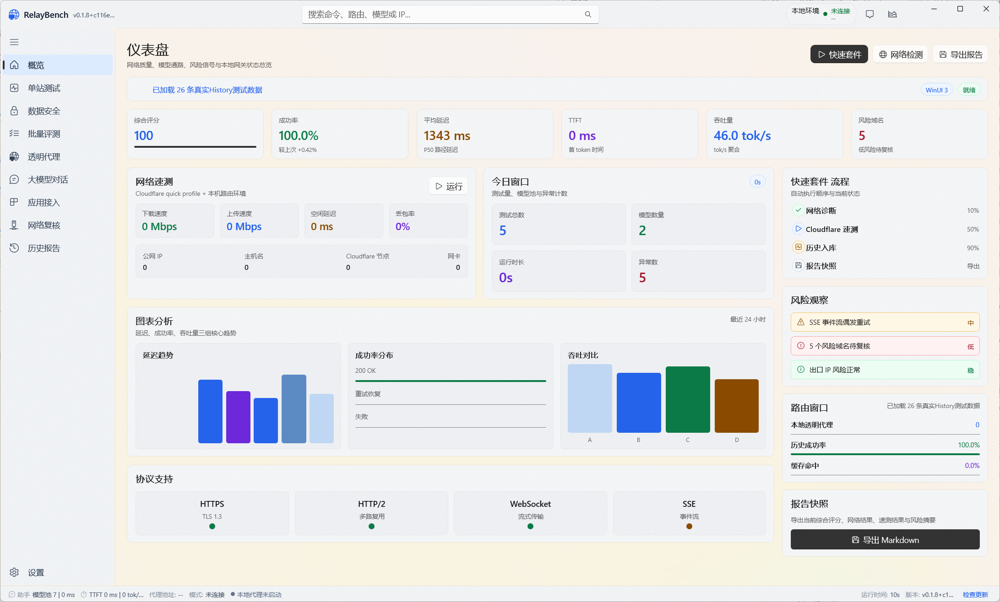
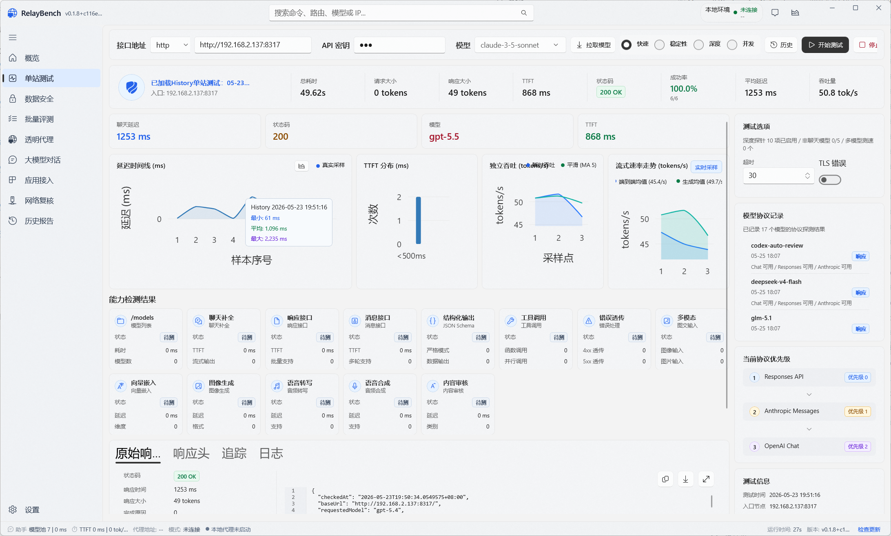

# RelayBench

RelayBench 是一个面向 AI 中转站、OpenAI 兼容接口和本地 AI 客户端的 Windows 桌面测试台。它把接口测速、协议兼容性、模型能力检查、批量评测、透明代理、网络复核和报告导出放在同一个应用里，帮助你判断一个入口能不能稳定地用于日常对话、Codex、Agent、RAG 或自动化工作流。

当前版本以 WinUI 3 重写界面，重点是更清晰的导航、更完整的实时指标、更现代的半透明桌面体验，以及适合长期观察的历史记录和报告能力。

## 界面预览

### 概览仪表盘



### 单站测试



## 适合谁使用

- 想快速判断一个中转接口是否可用、稳定、低延迟的用户。
- 需要比较多个入口，筛出主用、备用和候选节点的用户。
- 需要确认接口是否兼容 Chat Completions、Responses API、Anthropic Messages、SSE 流式输出、工具调用和结构化输出的用户。
- 使用 Codex、Claude、Gemini、VS Code 插件或其他本地 AI 客户端，希望统一接入和切换入口的用户。
- 想排查出口 IP、DNS、路由、Cloudflare 测速、NAT、端口和网络风险的用户。

## 主要功能

### 概览

打开应用后可以先从概览页查看当前整体状态：综合评分、成功率、平均延迟、TTFT、吞吐量、风险域名、网络测速、最近测试窗口、协议支持和报告快照。概览页适合用来快速确认今天的入口质量，也适合在长时间运行后回看历史趋势。

### 单站测试

单站测试用于深入检查一个接口地址。你可以填入 Base URL、API Key 和模型名，然后选择快速、稳定性、深度或并发测试模式。

单站测试会展示：

- 总耗时、请求大小、响应大小、状态码、成功率、平均延迟、TTFT 和 tok/s。
- 延迟时间线、TTFT 分布、独立吞吐曲线和流式速率趋势。
- `/models`、聊天补全、响应接口、消息接口、结构化输出、工具调用、错误透传、多模态、向量嵌入、图像生成、语音能力和内容审核等能力检测项。
- 原始响应、响应头、追踪信息和日志，方便定位是接口、模型、网络还是协议兼容问题。
- 历史测试结果和模型协议记录，便于观察同一个入口在不同时间的表现。

### 批量评测

批量评测用于维护多个入口并做横向比较。你可以导入或编辑站点列表，把入口分组，然后统一跑快速评测或深度评测。

它适合做这些事：

- 批量比较延迟、成功率、TTFT、吞吐量和稳定性。
- 给入口排序，挑选主用、备用和候选节点。
- 对候选入口继续发起深度测试。
- 避免同一站点被过度并发请求，减少误判和额度抢占。
- 把排名靠前的入口应用到支持的本地客户端。

### 透明代理

透明代理用于把本机 AI 客户端接到 RelayBench 的统一入口上。它可以在本地启动代理服务，接收客户端请求，再根据你的路由、模型、协议和健康状态转发到上游。

当前透明代理重点支持：

- OpenAI Chat Completions、OpenAI Responses、Anthropic Messages 和 Gemini 相关协议适配。
- 模型别名、协议发现、请求分类、路由策略、失败切换、冷却、熔断和健康记录。
- SSE 流式转发、工具调用流式归一化、响应归一化、usage 与 token 遥测。
- 响应缓存、提示词会话缓存、请求捕获、运行日志和趋势观察。
- Codex、Claude、VS Code 等本地客户端的配置识别、写入和恢复。

这个功能适合需要频繁切换入口、统一管理密钥、观察真实客户端请求，或者想让多个工具共用同一套路由策略的用户。

### 大模型对话

大模型对话页可以直接使用当前入口进行真实多轮对话，观察模型在实际使用中的流式输出、上下文保持、格式稳定性和响应速度。

支持的体验包括：

- 单模型或多模型候选对话。
- 系统提示词、温度、最大 token 和 reasoning 参数。
- 图片输入、文本附件、Markdown 展示和代码块复制。
- 会话列表、会话重命名、预设提示词、Markdown / 文本导出。

### 应用接入

应用接入页用于检查本机 AI 客户端的安装和配置状态，并把当前入口写入支持的客户端。

它可以帮助你：

- 识别 Codex CLI、Codex Desktop、VS Code Codex、Claude CLI 等本地工具。
- 查看安装状态、配置状态、API 可达性和当前入口。
- 在写入前预览配置变化。
- 一键恢复官方默认配置。
- 在官方入口和第三方入口之间切换时减少手动改文件的成本。

### 网络复核

网络复核页用于判断问题是不是来自本机网络、出口 IP、DNS、路由或上游风控，而不是模型本身。

当前能力包括：

- 本机网络快照、网卡、公网 IP 和基础 Ping。
- Cloudflare 风格下载、上传、延迟、抖动和丢包测速。
- `chatgpt.com/cdn-cgi/trace` 解析和 Web API 区域观察。
- 常见 AI 服务可访问性检查。
- `tracert` 和 MTR 风格逐跳采样。
- OpenStreetMap 路由地图渲染。
- 出口 IP、DNS、分流路径、多出口复核和风险来源检查。
- NAT / STUN 映射观察。
- 异步 TCP / UDP 轻量端口扫描和批量扫描。

### 数据安全

数据安全页用于查看和整理与本地配置、历史记录、报告、密钥和客户端写入相关的证据。RelayBench 会尽量把敏感信息做本地保护和脱敏展示，避免在报告和日志里直接暴露完整密钥。

### 历史报告

历史报告用于回看最近的测试、网络复核和批量评测结果。你可以浏览历史摘要、打开原始证据、查看图表，并导出 Markdown 报告用于记录、分享或归档。

## 基本使用流程

1. 在单站测试页填入接口地址、API Key 和模型名。
2. 先运行快速测试，确认接口是否可用。
3. 如果结果正常，再运行稳定性、深度或并发测试。
4. 有多个入口时，把它们加入批量评测，按成功率、延迟、TTFT 和吞吐量排序。
5. 需要接入本机工具时，进入应用接入或透明代理页，把当前入口应用到 Codex、Claude、VS Code 等客户端。
6. 如果出现失败、慢、流式异常或地区限制，再进入网络复核页定位原因。
7. 测完后从历史报告导出 Markdown，保留当时的指标和证据。

## 本地数据与隐私

RelayBench 的配置、历史、缓存和报告默认保存在本机。可以通过 `RELAYBENCH_WORKSPACE_ROOT` 指定工作目录；未指定时，应用会优先使用可写的本地目录。

常见本地数据包括：

- `data/app-state.json`：应用状态。
- `config/proxy-relay.json`：入口配置副本。
- `data/chat-sessions.json`：对话会话和提示词预设。
- `data/proxy-trends.json`：入口趋势记录。
- `data/endpoint-model-cache.sqlite`：模型列表和协议探测缓存。
- `data/reports`：历史报告归档。
- `data/exports`：导出结果。
- `data/map-tiles`：地图瓦片缓存。

部分网络复核功能会访问在线服务来获取出口、路由、风险和地理信息。应用会对部分结果做本地缓存，以减少重复请求。

## 运行环境

发布包运行环境：

- Windows 10 / Windows 11。
- Windows App Runtime 2.0。
- framework-dependent 包需要安装 .NET Desktop Runtime 10。
- self-contained 包会内置 .NET 运行时，但仍需要 Windows App Runtime 2.0。

源码构建环境：

- Windows 10 / Windows 11。
- .NET SDK 10。

## 从源码运行

在仓库根目录执行：

```powershell
dotnet build .\RelayBenchSuite.slnx -c Debug -v minimal
dotnet run --project .\RelayBench.WinUI\RelayBench.WinUI.csproj -c Debug
```

## 构建发布包

生成 framework-dependent 包：

```powershell
powershell -NoProfile -ExecutionPolicy Bypass -File .\publish.ps1 -Configuration Release -Runtime win-x64
```

同时生成 self-contained 包：

```powershell
powershell -NoProfile -ExecutionPolicy Bypass -File .\publish.ps1 -Configuration Release -Runtime win-x64 -IncludeSelfContained
```

输出文件会生成到 `release\` 目录，例如：

## 项目结构

- `RelayBench.WinUI`：WinUI 3 桌面界面、页面、弹窗、ViewModel、图表、托盘和本地交互。
- `RelayBench.Core`：接口诊断、协议探测、网络测速、路由复核、端口扫描、报告和高级测试核心逻辑。
- `RelayBench.Services`：透明代理、客户端配置写入、OAuth、协议转换、缓存、转发和运行时服务。
- `docs/images`：README 和发布说明使用的图片资产。
- `publish.ps1`：发布包构建脚本。

## License

RelayBench 基于 [MIT License](LICENSE) 开源发布。
