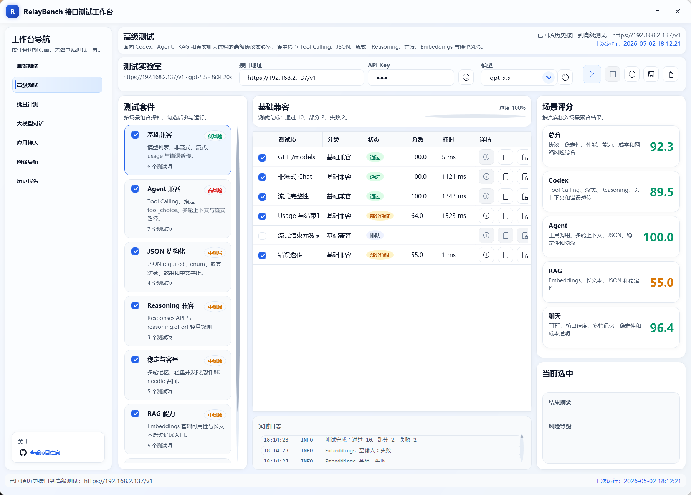
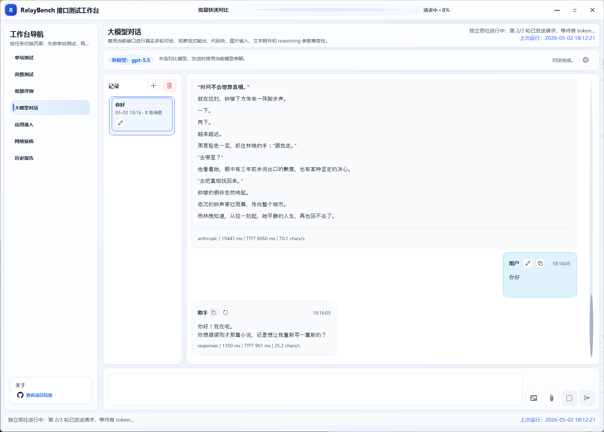
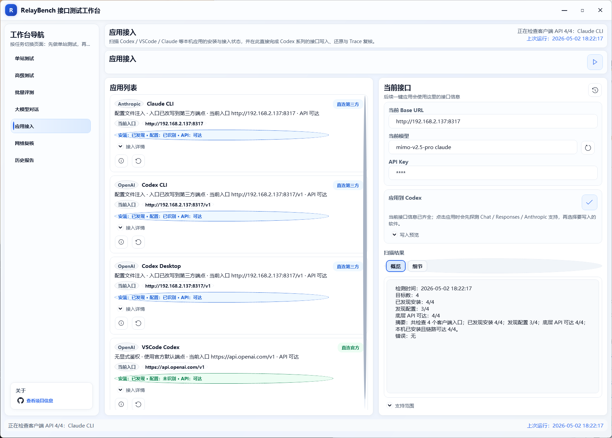

# RelayBench

RelayBench 是一个面向中转站、OpenAI 兼容接口和本地 AI 客户端接入的 Windows 桌面测试工作台。它把接口可用性、协议兼容性、吞吐表现、批量排序、真实对话、客户端配置和本机网络复核放在同一个应用里，帮助你判断一个入口是否适合长期使用。

当前版本更偏向“接口测试工作台”而不是单纯测速工具：既能跑快速探测，也能做 Agent、JSON、Reasoning、Embeddings、流式输出、并发和长上下文等高级场景检查。

## 界面预览

### 单站测试


### 高级测试



### 大模型对话



### 入口组累计对比图


### 应用接入



## 主要功能

### 1. 单站测试

用于快速判断单个接口是否可用、延迟是否可接受、协议链路是否正常，以及是否适合继续挂载。

当前支持：

- `GET /models` 模型列表探测。
- Chat Completions、Responses API、Anthropic Messages 基础兼容探测。
- 普通对话、流式对话、结构化输出、错误透传和 usage 观察。
- TTFT、普通延迟、tok/s、独立吞吐 3 轮均值统计。
- 基础测试、稳定性测试、深度测试和并发压测模式。
- 模型能力矩阵、流式完整性、缓存机制、多模态和非聊天 API 扩展检查。
- 测试结果摘要、原始输出、响应头、解析 IP、CDN / 边缘特征和可追溯性观察。

### 2. 高级测试

用于按真实接入场景组合测试套件，重点检查接口是否能支撑 Codex、Agent、RAG 和复杂聊天工作流。

内置测试套件包括：

- 基础兼容：模型列表、非流式、流式、usage、终止元数据和错误透传。
- Agent 兼容：Tool Calling、指定 `tool_choice`、工具结果回传、多轮上下文和流式路径。
- JSON 结构化：JSON required、enum、嵌套对象、数组、Markdown fence 和中文转义。
- Reasoning 兼容：Responses API、`reasoning.effort`、reasoning 内容回放。
- 稳定与容量：多轮记忆、轻量并发、并发阶梯、8K / 16K needle 召回。
- RAG 能力：Embeddings 基础可用性、相似度、空输入和长文本。
- 模型风险：模型自报、指纹观察和疑似不一致风险提示。

运行结果会生成场景评分，按 Codex、Agent、RAG、聊天等维度聚合，便于直接判断入口适配方向。

### 3. 批量评测

用于维护多个入口并做快速排序、候选筛选和长期对比。

当前支持：

- 入口组导入、编辑、分组和批量模板维护。
- 批量快速对比与排行榜排序。
- 手动选择主用、备用、候选入口。
- 对已选入口继续发起批量深度测试。
- 同站点入口顺序调度，避免同时抢占同一站点额度。
- 批量深测最多 5 个并发任务。
- 入口组累计对比图，展示综合分、普通延迟、TTFT、吞吐和稳定性。
- 排名入口一键应用到 Codex 系列客户端。

### 4. 大模型对话

用于复用当前接口做真实多轮聊天，观察它在实际使用中的流式输出、格式保持和上下文表现。

当前支持：

- 单模型或多模型候选对话。
- 流式输出、TTFT、耗时和字符速度统计。
- 系统提示词、温度、最大 token 和 reasoning 参数配置。
- 图片输入、文本附件和代码块展示。
- 消息复制、代码块复制、重新生成、编辑用户消息。
- 会话列表、会话重命名、预设提示词和 Markdown / 文本导出。

### 5. 应用接入

用于检查本机 AI 客户端安装与配置状态，并把当前入口写入支持的客户端。

当前支持：

- Codex CLI、Codex Desktop、VSCode Codex 接入识别。
- Claude CLI 与 Antigravity 接入状态扫描。
- 安装状态、配置状态、API 可达性和当前入口展示。
- 当前 Base URL、API Key、模型统一维护。
- 应用到 Codex 系列前自动探测 Chat / Responses / Anthropic 支持。
- 写入预览、原始 Trace 查看和一键还原官方默认配置。
- 官方 / 第三方切换时按需整理聊天记录显示。

### 6. 网络复核

用于在接口异常、延迟异常或能力异常时辅助判断问题来源。

当前支持：

- 本机网络快照、网卡、公网 IP 和基础 Ping。
- `chatgpt.com/cdn-cgi/trace` 解析与网页 API 区域观察。
- 常见 AI 服务可访问性检查。
- Cloudflare 风格下载、上传、延迟、抖动和丢包测速。
- `tracert` 与 MTR 风格逐跳延迟 / 丢包采样。
- OpenStreetMap 路由地图渲染。
- 出口 IP、DNS、分流路径和多出口复核。
- 多源出口 IP 风险复核。
- NAT / STUN 映射观察和 NAT 类型尽力判断。
- 内置异步 TCP / UDP 轻量端口扫描、批量扫描和结果导出。

### 7. 历史报告

用于回看最近诊断、归档报告并导出结构化结果。

当前支持：

- 最近测试历史回看。
- 单站、稳定性、批量和网络结果归档。
- 报告浏览、摘要生成和导出。
- 原始输出、图表、结果摘要和附件打包。

## 技术栈

- .NET 10
- WPF
- C#
- xUnit
- SQLite
- Windows 桌面应用

## 项目结构

- `RelayBench.App`：WPF UI、页面、ViewModel、本地状态、图表渲染、聊天会话和报告导出。
- `RelayBench.Core`：接口诊断、协议探测、测速、STUN、路由、端口扫描、客户端配置写入和高级测试核心逻辑。
- `RelayBench.Core.Tests`：核心逻辑测试，覆盖路径拼接、SSE 解析、响应文本提取、高级测试、脱敏和导航顺序。
- `docs`：界面截图、设计记录、测试计划和阶段性方案文档。
- `release`：发布脚本生成的压缩包与校验文件目录。

## 本地数据

应用会优先使用可写的工作目录保存数据。可通过 `RELAYBENCH_WORKSPACE_ROOT` 指定根目录；未指定时会依次尝试应用目录、`LOCALAPPDATA\RelayBench` 和临时目录。

常见数据文件：

- `data/app-state.json`：应用状态。
- `config/proxy-relay.json`：接口配置副本。
- `data/chat-sessions.json`：聊天会话与提示词预设。
- `data/proxy-trends.json`：入口趋势记录。
- `data/endpoint-model-cache.sqlite`：模型列表与协议探测缓存。
- `data/reports`：报告归档。
- `data/exports`：导出结果。
- `data/map-tiles`：地图瓦片缓存。

敏感字段会通过本机保护机制存储，避免明文直接落盘。

## 环境要求

### 从源码构建与运行

- Windows 10 / 11
- .NET SDK 10

### 运行发布版

- Windows 10 / 11
- `framework-dependent` 包需要预先安装 .NET Desktop Runtime 10，体积更小。
- `self-contained` 包内置运行时，可直接分发给未安装运行时的机器。

## 从源码运行

在仓库根目录执行：

```powershell
dotnet build .\RelayBenchSuite.slnx -c Debug -v minimal
dotnet run --project .\RelayBench.App\RelayBench.App.csproj -c Debug
```

运行测试：

```powershell
dotnet test .\RelayBench.Core.Tests\RelayBench.Core.Tests.csproj -c Debug -v minimal
```

## 构建发布版

在仓库根目录执行：

```cmd
publish.cmd
```

脚本会读取 `Directory.Build.props` 中的版本号，并在 `release\` 目录下生成：

- `relaybench-v<版本号>-win-x64-framework-dependent.zip`
- `relaybench-v<版本号>-win-x64-framework-dependent.sha256.txt`
- `relaybench-v<版本号>-win-x64-self-contained.zip`
- `relaybench-v<版本号>-win-x64-self-contained.sha256.txt`

例如当前版本会生成：

```text
release\relaybench-v0.1.6-win-x64-framework-dependent.zip
release\relaybench-v0.1.6-win-x64-self-contained.zip
```

## 在线数据源

部分功能会访问以下在线服务：

- OpenStreetMap：地图瓦片背景。
- `chatgpt.com/cdn-cgi/trace`：出口信息与地区观察。
- Cloudflare Speed Test：下载、上传与延迟测量。
- iprisk.top：当前出口 IP 识别。
- ipapi.is：IP 风险与 ASN 信息。
- proxycheck.io：代理 / VPN 检查。
- ip-api.com：出口地区与基础网络信息。
- ipwho.is：地理与 ASN 信息补充。
- country.is：轻量地理与 ASN 信息补充。
- IP2Location.io：IP 类型与风险补充。
- GreyNoise Community：噪声 / 扫描情报。
- Spamhaus DROP / ASN-DROP：威胁情报名单。
- AlienVault OTX：威胁情报补充。
- Shodan InternetDB：暴露面补充。
- abuse.ch Feodo Tracker：恶意基础设施名单。
- Tor Project：Tor 出口校验。

应用会对部分结果进行本地缓存，以减少重复请求。

## License

本项目基于 [MIT License](LICENSE) 开源发布。
