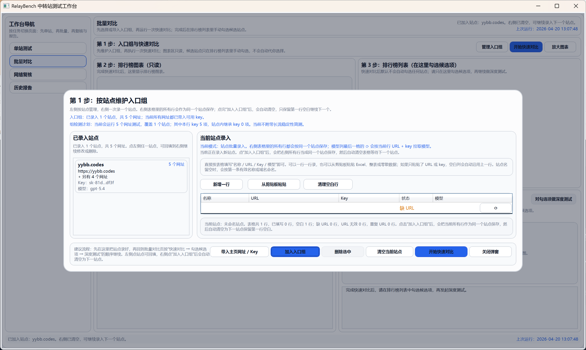
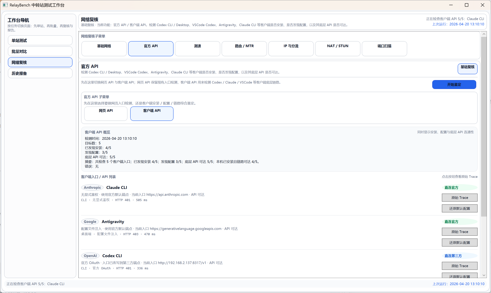
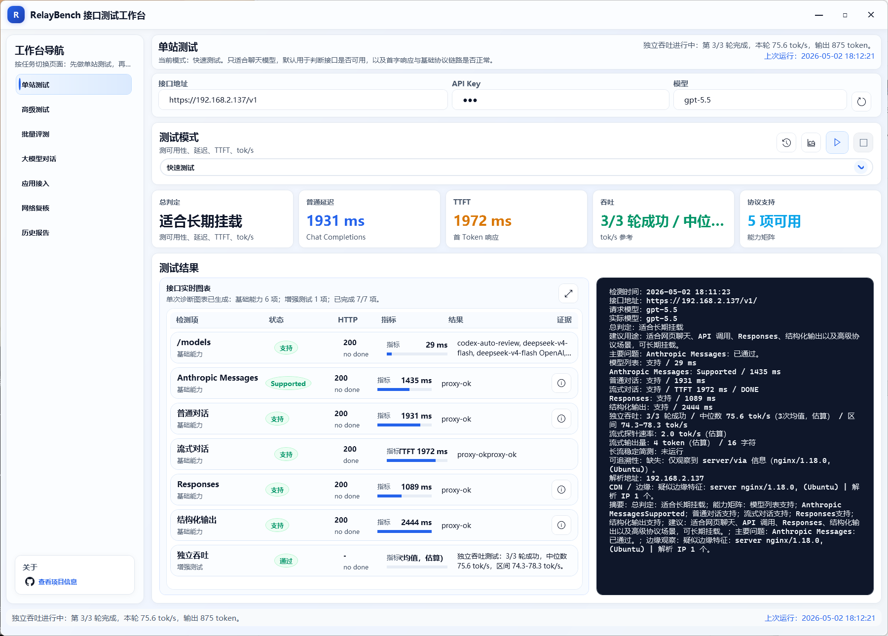
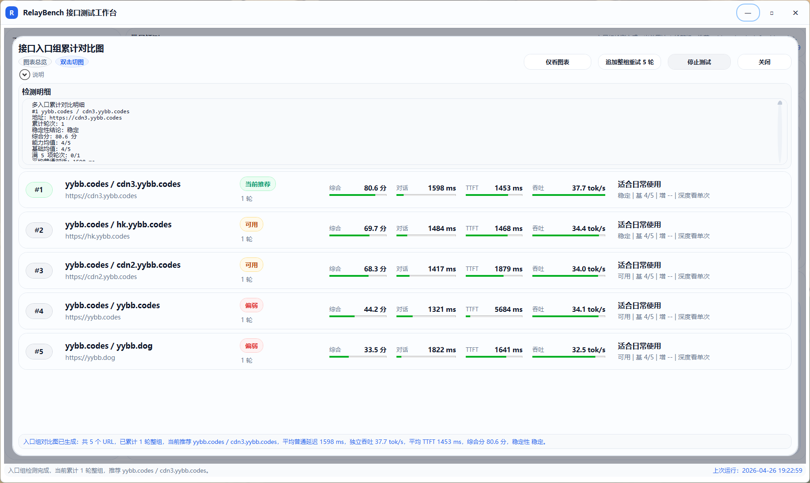

# RelayBench

用来给 OpenAI 兼容接口跑分，对比速度与兼容性，筛选出最合适的入口。

- 对单个接口做快速测试、稳定性测试和深度测试。
- 对多个接口做批量快速对比、排行榜排序和候选深测。
- 在接口不可用、延迟异常或能力异常时，借助网络复核能力区分是本地网络问题还是目标接口问题。

## 界面预览

### 入口组批量录入




### 客户端 API 复核



### 单站深度测试



### 入口组累计对比图



## 主要功能

### 1. 单站测试

用于测试单个接口当前是否可用、是否稳定，以及是否适合继续接入。

当前支持：

- 快速测试
- 稳定性测试
- 深度测试
- 模型拉取与基础兼容性验证
- 流式首字延迟（TTFT）与流式响应表现观察

### 2. 批量对比

用于对多个接口进行快速筛选、排序和选优。

当前支持：

- 入口组导入与编辑
- 批量快速对比
- 排行榜图表与列表展示
- 手动勾选候选站点
- 对勾选站点继续发起批量深度测试

### 3. 网络复核

用于在测试结果异常时辅助排查问题来源。

当前支持：

- 基础网络检查
- 网页 API Trace 与地区信息观察
- 官方 API 可访问性检查
- NAT / STUN 观察
- 路由与 MTR 风格链路检查
- Cloudflare 风格测速
- 分流与出口复核
- 本地端口扫描

### 4. 历史报告

用于查看历史结果、归档诊断信息，并导出结构化报告。

当前支持：

- 最近测试历史回看
- 报告归档浏览
- 报告导出
- 原始输出与结果摘要打包

## 当前版本已实现能力

### 接口测试相关

- OpenAI 兼容接口的基础可用性测试
- `GET /models` 探测
- 小体积非流式请求测试
- 流式请求测试与 TTFT 采样
- 多轮稳定性测试、成功率统计与连续失败统计
- 批量候选站点对比与综合评分排序
- 单站 / 稳定性 / 批量结果的本地历史记录

### 网络复核相关

- 本机网络基础信息采集
- `chatgpt.com/cdn-cgi/trace` 解析
- OpenAI 支持地区快照对照
- 常见 AI 服务可访问性检查
- STUN 映射地址与 NAT 类型的尽力判断
- `tracert` 与逐跳延迟/丢包采样
- OpenStreetMap 路由地图渲染
- Cloudflare 风格下载/上传测速
- 出口 IP、DNS 与分流路径复核
- 内置异步 TCP 端口扫描引擎

## 技术栈

- .NET 10
- WPF
- C#
- Windows 桌面应用

## 环境要求

### 从源码构建与运行

- Windows 10 / 11
- .NET SDK 10

### 运行发布版

- Windows 10 / 11
- `framework-dependent` 包：需要预先安装 .NET Desktop Runtime 10，体积最小
- `self-contained` 包：无需预装运行时，下载后可直接运行，但体积更大

## 从源码运行

在仓库根目录执行：

```powershell
dotnet build .\RelayBenchSuite.slnx -c Debug -v minimal
dotnet run --project .\RelayBench.App\RelayBench.App.csproj -c Debug
```

## 构建发布版

在仓库根目录执行：

```cmd
publish.cmd
```

脚本会自动读取 `Directory.Build.props` 中的版本号，并在 `release\` 目录下同时生成两套发布产物：

- `relaybench-v<版本号>-win-x64-framework-dependent.zip`
- `relaybench-v<版本号>-win-x64-framework-dependent.sha256.txt`
- `relaybench-v<版本号>-win-x64-self-contained.zip`
- `relaybench-v<版本号>-win-x64-self-contained.sha256.txt`

命名说明：

- `framework-dependent`：依赖本机 .NET Desktop Runtime 10，适合追求小体积的场景
- `self-contained`：内置运行时，适合直接分发给未安装运行时的机器

例如当前版本会生成：

```text
release\relaybench-v0.1.5-win-x64-framework-dependent.zip
release\relaybench-v0.1.5-win-x64-self-contained.zip
```

## 目录说明

- `RelayBench.App`：WPF UI、页面、ViewModel 与本地状态管理
- `RelayBench.Core`：网络诊断、测速、STUN、路由、端口扫描与接口测试核心逻辑

## 当前依赖的在线数据源

当前版本在部分功能中会访问以下在线服务：

- OpenStreetMap：地图瓦片背景
- ipwho.is：公网路由节点地理信息查询
- Cloudflare Speed Test：下载、上传与延迟测量
- `chatgpt.com/cdn-cgi/trace`：出口信息与地区观察

应用会对部分结果进行本地缓存，以减少重复请求。

## License

本项目基于 [MIT License](LICENSE) 开源发布。
