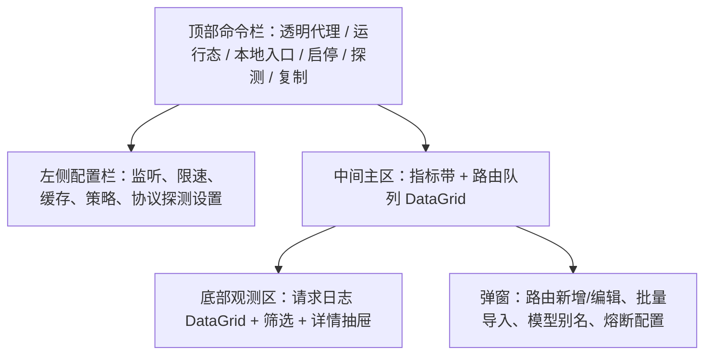
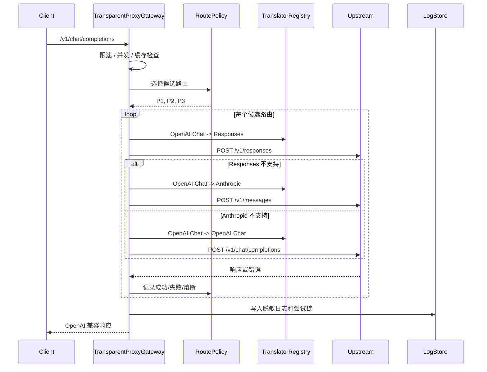

# RelayBench 本地透明代理入口调度器优化施工文档

> 日期：2026-05-03  
> 范围：`透明代理` / `本地透明代理模式` / `入口调度器`  
> 参考项目：`cc-switch`、`CLIProxyAPI`  
> 目标状态：先把当前 UI 从“能放下控件”修到“可长期使用”，再把透明代理从测试辅助升级为可观测、可 fallback、可自动选路的本地入口调度器。

## 0. 当前结论

当前 RelayBench 已经具备透明代理雏形：

- `RelayBench.App/Services/TransparentProxyService.cs` 已能监听本地端口、转发请求、限速、并发保护、短缓存、fallback、脱敏日志、指标事件。
- `RelayBench.App/ViewModels/MainWindowViewModel.TransparentProxy.cs` 已能从当前接口和批量候选生成路由，并通过 `ProxyEndpointModelCacheService` 保存模型协议探测结果。
- `/v1/chat/completions` 请求已经开始按 `Responses -> Anthropic -> OpenAI Chat` 生成上游协议尝试，这是正确方向。

但当前实现还不能称为入口调度器，主要缺口在 UI、配置模型、路由策略、观测、熔断和安全接管：

- 当前透明代理页存在明显 UI 问题：三列拥挤、左侧路由大文本框不可读、表格列截断、日志卡片占位过大、端点文本被压缩、信息层级混乱。
- XAML 和部分 ViewModel 文案出现编码异常，需要统一为 UTF-8，并把所有中文文案重写为可读文本。
- 路由配置仍是 `名称 | Base URL | 模型 | API Key` 文本，不适合做优先级、健康状态、模型别名、协议能力、熔断策略和批量操作。
- 透明代理服务承担了监听、协议转换、路由、缓存、fallback、指标等多项职责，后续继续堆在一个类里会变成难维护的大类。

本次优化的施工原则：

- 先救 UI，再扩展网关能力；UI 不稳定时不要继续堆功能。
- 只搬运参考项目的成熟设计，不直接复制代码。RelayBench 用 C# / WPF / 现有服务体系原生实现。
- 默认绑定 `127.0.0.1`，管理能力只允许本机，所有日志和 UI 必须脱敏。
- 每个阶段完成后都要构建、测试、发布覆盖 `H:\relaybench-v0.1.4-win-x64-framework-dependent`，并启动发布目录中的应用保持打开。

## 1. 参考项目可搬运点

### 1.1 从 cc-switch 搬运的产品和交互能力

参考位置：

- `cc-switch-retry/docs/proxy-guide-zh.md`
- `cc-switch-retry/docs/user-manual/zh/4-proxy/4.1-service.md`
- `cc-switch-retry/docs/user-manual/zh/4-proxy/4.2-routing.md`
- `cc-switch-retry/docs/user-manual/zh/4-proxy/4.3-failover.md`
- `cc-switch-retry/docs/user-manual/zh/4-proxy/4.4-usage.md`
- `cc-switch-retry/docs/user-manual/zh/4-proxy/4.5-model-test.md`
- `cc-switch-retry/src/components/proxy/ProxyPanel.tsx`
- `cc-switch-retry/src-tauri/src/services/proxy.rs`
- `cc-switch-retry/src-tauri/src/proxy/server.rs`
- `cc-switch-retry/src-tauri/src/proxy/types.rs`

可搬运到 RelayBench 的内容：

| 能力 | cc-switch 做法 | RelayBench 适配 |
| --- | --- | --- |
| 服务开关 | 顶部运行态 + 代理服务开关 | 透明代理页顶部命令栏放运行态、监听地址、启动/停止、复制入口 |
| 运行态分层 | 未运行时显示地址/端口设置，运行时显示服务地址、当前目标、统计 | RelayBench 运行中锁定监听端口，只允许调路由启停和策略 |
| App 接管 | 对 Claude/Codex/Gemini 独立接管，写入配置前备份，失败自动恢复 | 放到第二阶段之后，先做“应用接入向导”，写入任何客户端配置前必须生成可恢复备份 |
| 故障转移队列 | 按 app_type 维护优先级队列，显示 P1/P2、当前使用、健康 Badge | RelayBench 路由表新增 `优先级`、`启用`、`当前命中`、`健康`、`熔断状态` 列 |
| 熔断器 | failure threshold、success threshold、timeout、error-rate、min requests | 新增 `ProxyCircuitBreaker`，路由状态为 Closed/Open/HalfOpen，UI 可查看和手动重置 |
| Stream Check | 低成本流式健康检查，关注 TTFB、流中断、退化阈值 | RelayBench 复用现有协议探测和流式稳定性探针，作为“健康检查/模型探测”按钮 |
| 用量观测 | 请求日志、CLI 会话、摘要卡、趋势、筛选 | RelayBench 新增请求日志表、筛选栏、详情抽屉、指标卡和路由级统计 |
| 安全接管 | start_with_takeover 先备份，再写代理配置，异常恢复 | 如果实现客户端配置接管，必须作为独立服务，不写在代理转发服务里 |

不直接搬运的内容：

- Tauri/React 组件和 Rust 代理实现不直接复制。
- 多应用接管先不作为 MVP 主线，避免在 UI 还不稳时引入配置写入风险。
- cc-switch 的 App 维度是 Claude/Codex/Gemini，RelayBench 第一版按“上游路由/协议能力”组织。

### 1.2 从 CLIProxyAPI 搬运的网关内核能力

参考位置：

- `CLIProxyAPI/README_CN.md`
- `CLIProxyAPI/config.example.yaml`
- `CLIProxyAPI/sdk/translator/pipeline.go`
- `CLIProxyAPI/sdk/translator/registry.go`
- `CLIProxyAPI/sdk/api/handlers/openai/openai_responses_handlers.go`
- `CLIProxyAPI/internal/api/server.go`

可搬运到 RelayBench 的内容：

| 能力 | CLIProxyAPI 做法 | RelayBench 适配 |
| --- | --- | --- |
| 协议中立翻译层 | `RequestEnvelope` / `ResponseEnvelope` + translator registry + middleware pipeline | 新增 C# `WireProtocolTranslatorRegistry`，从 `TransparentProxyService` 中拆出协议转换 |
| 多协议端点 | `/v1/chat/completions`、`/v1/responses`、Anthropic 路径、兼容路由 | RelayBench MVP 先保证 OpenAI 入口请求可转 Responses/Anthropic/OpenAI Chat，后续再开放原生 `/v1/responses` 和 `/v1/messages` |
| 路由策略 | round-robin、fill-first、session-affinity | RelayBench 新增路由策略：优先级、轮询、最低延迟、会话粘滞 |
| 重试与冷却 | request-retry、cooldown、quota exceeded switch | RelayBench 新增 route cooldown，熔断后按恢复窗口半开探测 |
| 模型别名和排除 | models alias、excluded-models wildcard | RelayBench 路由编辑器新增模型别名、排除规则，合并模型目录时生效 |
| per-provider headers/proxy | 每个 provider 支持自定义 headers、proxy-url、direct | RelayBench 第一版只做 headers，代理链路/direct 放到后续 |
| SSE 稳定处理 | Responses SSE framing，处理分隔符、JSON 数据行、流式错误 | RelayBench 将 SSE 处理从简单 copy 升级为协议感知转发，避免流式转换碎片错误 |
| 管理 API 安全 | 管理 API 默认本机 + secret key | RelayBench 管理端点只绑定 127.0.0.1，第一版不暴露远程管理 |
| keepalive | 非流式空行保活、流式 keepalive、首字节前安全重试 | RelayBench 新增流式首包超时、空闲超时和可选 SSE keepalive |

不直接搬运的内容：

- OAuth 多账号管理不是透明代理 MVP 目标。
- Redis/RESP 接口、Web 控制台、远程管理中心不进入当前阶段。
- 复杂 provider 类型先收敛为 RelayBench 已有 OpenAI 兼容、Responses、Anthropic 能力。

## 2. UI 施工方案

### 2.1 当前 UI 必修问题

必须先修复以下问题，任何新功能都不能加重这些问题：

- 顶部标题、按钮 Tooltip、左侧配置、表头和日志中存在乱码，必须统一为正确中文。
- 左侧固定 330px 太窄，大文本路由表占满高度，用户无法可靠编辑。
- 中间路由表列过多，`Base URL`、模型、协议支持、统计都被挤压，长文本没有 tooltip。
- 右侧日志是卡片列表，信息密度低，占用过宽，空白区域大。
- 指标卡文本堆叠为长句，不适合扫描。
- 运行状态、健康端点和本地入口同时挤在多张小卡里，信息重复。
- 页面使用多层 Border/卡片嵌套，视觉上像一堆盒子，降低可读性。

### 2.2 新布局

透明代理页改为“命令栏 + 左侧配置 + 主工作区 + 底部日志/详情”的运维控制台布局。



推荐 WPF 网格：

- 根布局：`Grid` 两行，顶部 `Auto`，内容 `*`。
- 内容区：两列，左侧 `MinWidth=360 MaxWidth=420 Width=380`，右侧 `*`。
- 右侧主区：三行，指标 `Auto`，路由 `2*`，日志 `1*`。
- 宽度小于 1366px 时，左侧配置可以收起为 48px 图标栏或移动到 Tab。

### 2.3 顶部命令栏

内容从左到右：

| 区域 | 内容 | 交互 |
| --- | --- | --- |
| 标题区 | `透明代理`，副标题 `本地入口调度器` | 不放说明型长文 |
| 状态区 | 运行态 Pill：`已停止` / `启动中` / `运行中` / `停止中` / `异常` | 颜色：灰、蓝、绿、橙、红 |
| 入口区 | `http://127.0.0.1:17880/v1` | 单击复制，复制成功 1.5s 内显示 `已复制` |
| 主按钮 | 启动 / 停止 | 启动中禁用，停止中禁用，失败时显示错误摘要 |
| 工具按钮 | 探测协议、刷新路由、导入、清空日志 | 使用 MDL2 图标或项目现有图标按钮，必须有 tooltip |

验收要求：

- 1366px 宽度下命令栏不换行挤压主按钮。
- 本地入口过长时只在入口区省略，不挤压启停按钮。
- 所有图标按钮固定 36x36 或 40x40，不因 tooltip 或状态变化改变尺寸。

### 2.4 左侧配置栏

左侧配置分为四个区域，不使用大文本框作为主编辑入口。

1. `监听`
   - 地址：默认 `127.0.0.1`，第一版不允许 `0.0.0.0`，避免开放到局域网。
   - 端口：`1024-65535`，运行中只读。
   - 健康端点：只读，可复制。

2. `保护`
   - 每分钟请求上限。
   - 并发上限。
   - 上游超时。
   - 流式首包超时。
   - 流式空闲超时。

3. `路由策略`
   - `优先级`：按表格顺序选择，失败再 fallback。
   - `轮询`：健康路由轮询。
   - `最低延迟`：按最近 P50/P95 选择。
   - `会话粘滞`：按 `X-Session-ID`、`conversation_id` 或前几轮消息 hash 绑定路由。

4. `缓存和日志`
   - 短缓存开关和 TTL。
   - 日志脱敏开关，默认开启且不可完全关闭脱敏。
   - 是否记录响应摘要，默认关闭；开启时只记录长度、状态、协议和脱敏后的错误片段。

左侧底部提供 `高级：查看原始路由文本`，仅用于批量导入/导出，不作为日常编辑。

### 2.5 路由队列 DataGrid

当前表格改为路由队列，主操作全部在表格和编辑弹窗内完成。

列定义：

| 列 | 宽度建议 | 内容 | UI 规则 |
| --- | --- | --- | --- |
| 优先级 | 56 | P1/P2/P3 | 固定宽度，圆形数字 |
| 启用 | 60 | Toggle | 固定宽度 |
| 名称 | 160 min | 路由名称 | 长文本省略 + Tooltip |
| Base URL | 240 min | 脱敏后的 URL | 长文本省略 + Tooltip |
| 模型 | 170 min | 上游模型 / 别名 | 长文本省略 + Tooltip |
| 协议 | 180 min | Responses / Anthropic / Chat badge | 不用 `R:Y A:N C:-` 这种压缩文字 |
| 健康 | 110 | Healthy / Degraded / Down / Probing | 颜色 Badge |
| 熔断 | 110 | Closed / Open / HalfOpen | 颜色 Badge + 可手动重置 |
| 延迟 | 90 | P50/P95 或最近耗时 | 右对齐 |
| 成功率 | 90 | 最近窗口成功率 | 右对齐 |
| 操作 | 120 | 编辑、探测、更多 | 图标按钮 |

DataGrid 规则：

- `EnableRowVirtualization=True`，`EnableColumnVirtualization=True`。
- 不允许核心列被压到 0；当窗口变窄时出现水平滚动，而不是文字重叠。
- 单元格统一 `TextTrimming=CharacterEllipsis`，所有长文本有 tooltip。
- 行高固定 40，表头高固定 36。
- 空状态显示 `还没有路由`，提供 `从当前接口生成` 和 `批量导入` 两个按钮。

### 2.6 路由编辑弹窗

新增/编辑路由使用弹窗，不再让用户直接维护管道分隔文本。

字段：

- 名称，必填。
- Base URL，必填，必须是 http/https。
- API Key，可空；为空时透传客户端 Authorization。
- 默认模型，可空；为空时使用请求中的模型。
- 模型别名：客户端模型名 -> 上游模型名。
- 排除模型：支持 `*` 通配符。
- 协议能力：自动探测结果只读，允许用户手动覆盖。
- 自定义 Headers：键值表，默认折叠。
- 优先级、启用状态。

弹窗验收：

- 720x560 内能完整显示主要字段。
- 保存前校验并在字段下方显示错误，不用 MessageBox 堆提示。
- API Key 输入框默认密码显示，只展示 `sk-...abcd` 预览。

### 2.7 请求日志和详情

右侧日志卡片列表改为底部 DataGrid：

列：

- 时间
- 状态
- 方法
- 路径
- 路由
- 协议
- 模型
- 耗时
- 结果
- 消息

交互：

- 顶部筛选：等级、路由、状态码、协议、是否 fallback、关键字。
- 单击行打开右侧详情抽屉，显示请求 ID、路由尝试链、fallback 原因、协议尝试顺序、脱敏后的错误片段。
- 提供 `清空当前视图` 和 `导出日志`。

日志安全：

- 不展示完整 API Key、Authorization、Cookie。
- URL query 中的 `key`、`token`、`authorization`、`password` 必须脱敏。
- 响应体默认不落库，只记录状态、长度、错误类型和最多 300 字脱敏错误摘要。

### 2.8 动画和状态

动画只服务状态变化，不做装饰动画。

| 场景 | 动画 | 时长 |
| --- | --- | --- |
| 启动/停止 | 状态 Pill 颜色和文字淡入淡出 | 160-200ms |
| 运行中区域出现 | 高度 + 透明度 | 200-240ms |
| 行健康状态变化 | 背景色过渡 | 150ms |
| 日志新行进入 | 轻微透明度过渡 | 120ms |
| 弹窗打开 | opacity + translateY 6px | 160ms |

必须支持：

- `prefers-reduced-motion` 等价设置：如果项目没有系统配置，就提供应用级 `MotionAssist` 开关或复用现有动效资源。
- 动画不得改变表格列宽、行高和按钮尺寸。

### 2.9 后台驻留和托盘交互

新增本地代理后，RelayBench 的窗口生命周期不能再等同于进程生命周期。只要代理正在运行、后台驻留开启，或悬浮 Token 仪表开启，点击主窗口右上角关闭按钮都不能直接退出软件，而是隐藏主窗口并驻留到系统托盘。

交互规则：

| 动作 | 行为 |
| --- | --- |
| 点击主窗口关闭 | 取消关闭事件，隐藏主窗口，托盘显示 `RelayBench 正在后台运行` |
| Alt+F4 | 与关闭按钮一致，隐藏到托盘 |
| 最小化 | 默认最小化到任务栏；设置中可切换为最小化到托盘 |
| 双击托盘图标 | 恢复主窗口并激活 |
| 右键托盘图标 | 打开托盘菜单 |
| 托盘菜单点击退出 | 停止透明代理、刷新日志、关闭悬浮窗，然后真正退出进程 |

托盘菜单：

- `打开 RelayBench`
- `启动透明代理` / `停止透明代理`
- `显示 Token 悬浮窗` / `隐藏 Token 悬浮窗`
- `后台运行：开/关`
- `退出 RelayBench`

视觉要求：

- 托盘气泡只在第一次隐藏到后台、代理异常、端口冲突、退出失败时出现，不要频繁打扰。
- 主窗口隐藏前给一个 160ms 的淡出，恢复时 160ms 淡入。
- 顶部命令栏增加一个小型后台状态点，显示 `后台驻留`，不要新增大卡片。

安全和可靠性：

- `退出 RelayBench` 是唯一真正退出入口；内部需要设置显式退出标记，避免被 `Closing` 事件再次拦截。
- 退出时如果透明代理正在处理请求，最多等待 3 秒 graceful shutdown，然后取消剩余请求。
- 应用崩溃或系统关机时不拦截系统关闭。

### 2.10 桌面悬浮 Token 仪表

新增一个桌面悬浮窗，定位为“轻量实时仪表”，不是缩小版控制台。它只展示最关键的 Token 流速和当前阶段累计，不放表格、不放说明文本、不塞按钮。

默认样式：

- 尺寸：`220 x 58`，可在设置中切换 `紧凑 176 x 46` 和 `详细 260 x 72`。
- 形态：半透明深色或浅色玻璃质感，8px 圆角，1px 柔和描边，轻阴影。
- 字体：数字使用等宽字体，标签使用项目正文小号字体。
- 颜色：流动中用青绿色高亮，空闲时用低饱和灰蓝，异常时用琥珀色，不使用大面积渐变。
- 位置：默认右上角，距屏幕边缘 18px；支持拖动和贴边吸附。
- 层级：默认置顶但不抢焦点；可在右键菜单切换 `置顶`、`锁定位置`、`鼠标穿透`。

显示逻辑：

| 状态 | 主显示 | 副显示 |
| --- | --- | --- |
| 有流式数据经过 | `42.8 tok/s` | 本阶段 `12.4k tokens` |
| 非流式请求刚完成 | `+861 tokens`，保持 2 秒 | 平均 `18.2 tok/s` |
| 无数据 5 秒后 | `12.4k tokens` | `本阶段累计` |
| 代理停止 | `0 tokens` | `等待请求` |
| 上游不返回 usage | `估算中` 或估算值 | 标签显示 `estimated` |

轮换规则：

- 有数据经过时优先显示每秒 token 数，刷新频率 1 秒。
- 无数据超过 5 秒后切到当前阶段累计 token。
- 空闲状态每 4 秒在 `本阶段累计`、`输入/输出比例`、`最近一次请求耗时` 三个轻量视图之间轮换。
- 鼠标悬停时暂停轮换并显示当前完整数值；鼠标离开 2 秒后恢复轮换。

交互：

- 拖动：移动位置，松手后吸附最近屏幕边缘。
- 双击：打开 RelayBench 并定位到透明代理页。
- 右键：显示菜单 `打开主窗口`、`锁定位置`、`鼠标穿透`、`重置本阶段计数`、`隐藏悬浮窗`。
- 单击：手动切换当前显示视图。

数据口径：

- `实时 token 数`：当前阶段累计输入 + 输出 tokens。
- `每秒 token 数`：优先使用流式输出 token 增量；非流式请求用输出 tokens / 请求耗时估算。
- `本阶段`：优先绑定当前运行任务；没有任务时绑定当前透明代理运行会话；代理重启后新开阶段。
- 上游返回 usage 时以 usage 为准；没有 usage 时用 `TokenCountEstimator` 估算，并在 UI 中标记为估算。
- 同一请求不能重复计数：流式估算值在最终 usage 到达后需要 reconcile。

精致度验收：

- 悬浮窗看起来像桌面状态仪表，不像一个小表单。
- 没有按钮边框、没有表格、没有大段文案。
- 数字变化有轻微滚动或淡入，不能闪烁。
- 透明背景下文字对比度足够，白色和深色桌面背景都可读。
- 多显示器、高 DPI、任务栏位置变化时不跑出屏幕。

## 3. 后端架构施工方案

### 3.1 拆分服务边界

当前 `TransparentProxyService` 职责过重。拆分目标如下：

| 新组件 | 职责 | 所属项目 |
| --- | --- | --- |
| `TransparentProxyGatewayService` | 监听、请求生命周期、响应写回 | `RelayBench.App` 或后续迁移 Core |
| `ProxyRoutePolicyService` | 按策略选择候选路由，处理 session affinity | `RelayBench.App` |
| `ProxyCircuitBreaker` | 路由熔断状态机，Closed/Open/HalfOpen | `RelayBench.Core` 更合适 |
| `ProxyHealthCheckService` | 周期健康检查、手动探测、模型协议探测调度 | `RelayBench.App` |
| `WireProtocolTranslatorRegistry` | OpenAI Chat / Responses / Anthropic 的请求和响应转换 | `RelayBench.Core` |
| `TransparentProxyLogStore` | 请求日志落库、查询、筛选、导出 | `RelayBench.App` |
| `TransparentProxyConfigStore` | 路由、策略、别名、熔断配置持久化 | `RelayBench.App` |
| `ProxySecretRedactor` | 请求、URL、Header、错误摘要脱敏 | `RelayBench.Core` 或复用 `ProbeTraceRedactor` |
| `TrayLifecycleService` | 托盘图标、关闭拦截、显式退出、后台状态 | `RelayBench.App` |
| `FloatingTokenMeterWindow` | 桌面悬浮 Token 仪表窗口 | `RelayBench.App` |
| `TokenUsageTelemetryService` | 聚合 usage、估算 token、计算 tok/s、阶段累计 | `RelayBench.App` 或 `RelayBench.Core` |

第一阶段可以不完全迁移到 Core，但必须停止继续扩大 `TransparentProxyService.cs`。

### 3.2 请求流程



### 3.3 协议尝试顺序

用户明确要求：

1. 优先尝试 Responses。
2. Responses 不可用时尝试 Anthropic。
3. Responses 和 Anthropic 都不可用时回退 OpenAI 兼容 Chat Completions。

准确实现规则：

- 如果模型缓存显示 `ResponsesSupported=true`，先尝试 Responses。
- 如果缓存未知，也先尝试 Responses，但只在可安全重试的失败上继续下一协议。
- Responses 返回 400/404/415，且错误类型指向 endpoint/model/protocol unsupported，尝试 Anthropic。
- Anthropic 返回 400/404/415，且错误类型指向 endpoint/model/protocol unsupported，尝试 OpenAI Chat。
- 401/403 默认不跨协议继续，因为大概率是鉴权问题；除非错误明确为某协议要求不同 Header。
- 429/500/502/503/504 进入 route fallback，不应在同一路由内无限切协议重试。
- 一旦响应头已经向客户端写出，不能再 fallback 到下一路由或下一协议。

### 3.4 协议转换层

新增 `WireProtocolTranslatorRegistry`，参考 CLIProxyAPI 的 envelope/registry/pipeline 思路。

建议类型：

```csharp
public enum WireProtocol
{
    OpenAiChat,
    OpenAiResponses,
    AnthropicMessages
}

public sealed record WireRequestEnvelope(
    WireProtocol Format,
    string Model,
    bool Stream,
    byte[] Body);

public sealed record WireResponseEnvelope(
    WireProtocol Format,
    string Model,
    bool Stream,
    byte[] Body,
    IReadOnlyList<byte[]> Chunks);
```

必须覆盖：

- OpenAI Chat request -> Responses request。
- OpenAI Chat request -> Anthropic Messages request。
- Responses non-stream -> OpenAI Chat non-stream response。
- Anthropic non-stream -> OpenAI Chat non-stream response。
- Responses SSE -> OpenAI Chat SSE。
- Anthropic SSE -> OpenAI Chat SSE。

验收点：

- 流式转换必须有专门测试，不能只靠手工跑通。
- SSE 分帧不能假设每个网络 chunk 都是一条完整事件。
- `[DONE]`、错误事件、心跳、空行都要有稳定处理。

### 3.5 路由策略

第一版提供四种策略：

| 策略 | 行为 | 适用场景 |
| --- | --- | --- |
| 优先级 | P1 成功一直用 P1，失败后按 P2/P3 fallback | 稳定主站 + 备用站 |
| 轮询 | 在健康路由间 round-robin | 多站均摊 |
| 最低延迟 | 选择近期 P50/P95 最低且健康的路由 | 速度优先 |
| 会话粘滞 | 同一会话优先绑定同一路由，失败时重新绑定 | 聊天上下文一致性 |

会话 ID 提取顺序：

1. `X-Session-ID`
2. `X-Client-Request-Id`
3. `conversation_id`
4. OpenAI messages 前几轮内容 hash
5. 无法提取时不粘滞

### 3.6 熔断和恢复

状态机：

- `Closed`：正常可用。
- `Open`：达到失败阈值，暂时不可选。
- `HalfOpen`：冷却时间到，允许少量探测请求。

默认参数：

- 连续失败阈值：5。
- 成功恢复阈值：2。
- 熔断冷却：60 秒。
- 错误率阈值：50%。
- 计算错误率最小请求数：10。

失败计数：

- 401/403：鉴权失败，标记 route degraded，但不立刻熔断所有模型。
- 404/400 protocol unsupported：只更新协议能力，不计入路由健康失败。
- 429：计入限额/冷却，不等同于网络失败。
- 5xx/timeout/connect error：计入熔断失败。

### 3.7 模型目录和协议能力持久化

当前项目已有 `ProxyEndpointModelCacheService`，不要另造一套完全重复的缓存。

需要补齐：

- 每个上游站点拉取 `/v1/models` 或等价目录。
- 每个模型保存支持协议：Responses、Anthropic、OpenAI Chat。
- 保存最后探测时间、失败原因、首选协议。
- UI 能展示站点级模型数量和协议覆盖率。
- 对模型别名和排除规则进行合并，生成客户端可见模型列表。

建议数据结构：

| 表/存储 | 字段 |
| --- | --- |
| `proxy_endpoint_model_cache` | 继续保存模型协议能力 |
| `transparent_proxy_routes` | route id、name、base_url、api_key_ref、enabled、priority、default_model、strategy_group |
| `transparent_proxy_route_models` | route_id、client_model、upstream_model、alias、excluded_pattern |
| `transparent_proxy_health` | route_id、state、last_status、p50、p95、success_rate、circuit_state |
| `transparent_proxy_request_logs` | request_id、time、method、path、route、protocol、status、latency、fallback_count、redacted_message |

API Key 不允许明文落普通 JSON，继续使用项目已有 `SecretProtector` 或等价机制。

### 3.8 缓存、限速和脱敏日志

短缓存：

- 只缓存非流式、成功状态、明确可缓存的只读请求。
- 默认不缓存带 tool call、文件、图片、明显长上下文请求。
- cache key 必须包含方法、路径、脱敏前 body hash、目标模型、路由 id。
- UI 展示 cache hit、cache entries、TTL。

限速：

- 第一版保留全局每分钟限速和并发限制。
- 第二版支持每路由限速，避免单个站点被打爆。

脱敏：

- Header：`Authorization`、`x-api-key`、`cookie`、`set-cookie`、`proxy-authorization`。
- Query：`key`、`api_key`、`token`、`access_token`、`password`、`secret`。
- Body：`api_key`、`authorization`、`password`、`secret`、`token`、`email`、`phone` 等字段只记录脱敏摘要。

### 3.9 后台生命周期服务

新增 `TrayLifecycleService`，不要把托盘逻辑散落在 `MainWindow.xaml.cs`。

实现要点：

- 使用 WPF 主线程创建和释放托盘图标；如果使用 `System.Windows.Forms.NotifyIcon`，项目文件需要启用 WinForms。
- `MainWindow.Closing` 中只做生命周期分发：如果不是显式退出且后台驻留条件成立，则 `e.Cancel = true` 并隐藏窗口。
- 显式退出必须经过 `TrayLifecycleService.RequestExitAsync()`，设置 `_isExplicitExit=true`，关闭悬浮窗，停止透明代理，释放托盘图标，再 `Application.Current.Shutdown()`。
- 系统关机、用户注销、进程崩溃不应弹出阻塞确认。
- 单实例策略后续可补：再次启动时激活已有主窗口，而不是开两个代理监听同一端口。

状态持久化：

- `RunInBackgroundEnabled`
- `MinimizeToTrayEnabled`
- `FloatingTokenMeterEnabled`
- `FloatingTokenMeterLeft/Top`
- `FloatingTokenMeterLocked`
- `FloatingTokenMeterClickThrough`

### 3.10 Token 用量遥测

新增 `TokenUsageTelemetryService`，由透明代理、模型聊天、高级测试和后续入口调度器共享。

事件模型：

```csharp
public sealed record TokenUsageSample(
    string Source,
    string PhaseId,
    string? RouteId,
    string? Model,
    long InputTokens,
    long OutputTokens,
    bool IsEstimated,
    DateTimeOffset Timestamp);
```

聚合规则：

- 每个请求分配 `request_id`，流式增量和最终 usage 都绑定同一个 request。
- OpenAI Chat：读取 `usage.prompt_tokens`、`usage.completion_tokens`、`usage.total_tokens`。
- OpenAI Responses：读取 `usage.input_tokens`、`usage.output_tokens`、`usage.total_tokens`。
- Anthropic：读取 `usage.input_tokens`、`usage.output_tokens`。
- 流式没有最终 usage 时，按增量文本用 `TokenCountEstimator` 估算。
- 最终 usage 到达后，用最终值替换估算值，差额写入 reconcile 事件，避免重复计数。
- tok/s 使用最近 1 秒输出 token 增量计算，空闲超过 5 秒后归零。

阶段定义：

- 高级测试运行时：阶段为当前测试运行 ID。
- 模型聊天运行时：阶段为当前聊天会话 ID。
- 透明代理独立运行时：阶段为当前代理运行会话 ID。
- 用户在悬浮窗右键 `重置本阶段计数` 时创建新的 phase segment，不清空历史日志。

## 4. 分阶段施工计划

### 阶段 A：UI 救火和乱码修复

目标：透明代理页先变成稳定、可读、不会截断的控制台。

改动：

- 修复 `TransparentProxyPage.xaml`、`MainWindowViewModel.TransparentProxy.cs`、`TransparentProxyRouteViewModel.cs` 中的乱码文案。
- 顶部命令栏重排，按钮状态和 tooltip 全部可读。
- 左侧配置栏增宽，隐藏原始路由大文本框到高级区域。
- 路由表改为可横向滚动的 DataGrid，列宽固定下限，长文本 tooltip。
- 日志从卡片列表改为 DataGrid。
- 指标卡从长句改为 4-6 个短指标：总请求、成功率、fallback、缓存命中、P95、活跃请求。

验收：

- 1366x768、1600x900、1920x1080 下无文字重叠、无核心按钮被挤出、无表头乱码。
- 路由超过 8 条时滚动正常，行高不抖动。
- 日志为空时有空状态，不出现大面积莫名空白。

### 阶段 B：路由配置结构化

目标：从文本路由表升级为可管理路由模型。

改动：

- 新增 `TransparentProxyRouteConfig` 和配置存储。
- 新增路由新增/编辑弹窗。
- 支持启用、优先级、默认模型、API Key 预览、别名、排除规则。
- 保留批量导入文本，但导入后转换为结构化路由。
- 从当前接口、批量候选、历史站点生成路由。

验收：

- 用户不需要编辑 `名称 | Base URL | 模型 | API Key` 也能完成所有常用配置。
- 路由配置重启应用后保留。
- API Key 不在 UI 和日志中明文出现。

### 阶段 C：协议翻译层

目标：把协议转换从代理服务中拆出来，保证 Responses 和 Anthropic fallback 可测试。

改动：

- 新增 `WireProtocolTranslatorRegistry`。
- 将 `AdvancedWireRequestBuilder.PreparePostJson` 的调用封装到 translator。
- 补齐 Responses/Anthropic 到 OpenAI Chat 的非流式和流式响应转换。
- 增加 SSE 分帧测试。

验收：

- OpenAI Chat 入站请求可在同一路由内按 `Responses -> Anthropic -> OpenAI Chat` 尝试。
- 非流式返回 OpenAI Chat 兼容 JSON。
- 流式返回 OpenAI Chat 兼容 SSE。
- 协议不支持时能更新模型协议缓存，不把协议失败误判为站点宕机。

### 阶段 D：自动选路、fallback、熔断

目标：形成真正的入口调度器。

改动：

- 新增路由策略服务。
- 新增熔断器状态机。
- 支持优先级、轮询、最低延迟、会话粘滞。
- 支持 route cooldown 和半开探测。
- UI 展示当前命中路由、fallback 次数、熔断状态。

验收：

- P1 失败后自动切到 P2，P1 冷却后半开探测成功再恢复。
- 同一会话在健康状态下保持同一路由。
- 429、401、协议不支持、5xx 的分类处理不同。

### 阶段 E：观测和日志落库

目标：用户能知道请求为什么走某条路、为什么 fallback、哪里慢。

改动：

- 新增请求日志落库。
- 新增日志筛选、详情抽屉、导出。
- 指标按 route 汇总：成功率、P50/P95、错误分布、cache hit、fallback。
- 健康检查和协议探测结果可在 UI 查看历史。

验收：

- 代理运行 30 分钟后 UI 不明显卡顿。
- 日志超过 2000 条时仍可筛选。
- 导出日志不含密钥。

### 阶段 F：后台驻留和桌面悬浮 Token 仪表

目标：让本地代理具备后台常驻能力，并提供一个精致、不打扰的桌面 Token 实时仪表。

改动：

- 新增 `TrayLifecycleService`，接管主窗口关闭行为。
- 新增系统托盘图标和右键菜单。
- 新增后台驻留设置，默认在代理运行时启用。
- 新增 `TokenUsageTelemetryService`，从透明代理请求、模型聊天和高级测试中接收 token usage。
- 新增 `FloatingTokenMeterWindow`，支持拖动、吸附、置顶、锁定、鼠标穿透、右键菜单。
- 主窗口关闭按钮改为隐藏到托盘，只有托盘右键 `退出 RelayBench` 才真正退出。

验收：

- 透明代理运行时点击关闭按钮，进程不退出，代理继续响应请求。
- 托盘右键退出能真正停止代理并退出进程。
- 悬浮窗有数据时显示 tok/s，无数据 5 秒后显示本阶段累计 token。
- 非流式和流式请求都能更新 token 计数。
- 悬浮窗位置、显示状态、锁定状态重启后保留。
- 悬浮窗在 100%、125%、150% DPI 下不模糊、不跑出屏幕。

### 阶段 G：应用接管和安全恢复

目标：将 RelayBench 从“给用户一个本地入口”升级为“可以安全写入客户端配置”。

改动：

- 支持 Claude/Codex/Gemini 或项目已有应用中心目标的代理入口接入。
- 写入前备份原配置，写入失败自动恢复。
- 运行中接管状态清晰显示，停止代理时提示是否恢复。
- 恢复失败时保留备份目录并给出路径。

验收：

- 写入失败不会破坏原客户端配置。
- 用户能一键恢复到接管前状态。
- 接管功能默认关闭，必须用户明确启用。

## 5. 测试计划

### 5.1 单元测试

新增或扩展：

- `TransparentProxyRoutePolicyTests`
- `ProxyCircuitBreakerTests`
- `WireProtocolTranslatorRegistryTests`
- `TransparentProxySseFramerTests`
- `TransparentProxySecretRedactorTests`
- `TransparentProxyRouteConfigStoreTests`
- `TrayLifecycleServiceTests`
- `TokenUsageTelemetryServiceTests`

重点断言：

- 协议尝试顺序严格为 Responses、Anthropic、OpenAI Chat。
- 协议不支持不触发 route 熔断。
- 首包后不能 fallback。
- API Key、Authorization、URL query secret 全部脱敏。
- session affinity 绑定过期后重新选择。
- 关闭按钮在后台驻留启用时不会触发进程退出。
- 流式估算 token 在最终 usage 到达后不会重复计数。
- 空闲超过 5 秒后 tok/s 归零并切换到阶段累计。

### 5.2 集成测试

用本地假上游：

- 上游 A：Responses 200。
- 上游 B：Responses 404、Anthropic 200。
- 上游 C：Responses 404、Anthropic 404、OpenAI Chat 200。
- 上游 D：连续 5xx，触发 fallback 和熔断。
- 上游 E：流式响应拆成半行 SSE chunk，验证分帧。

必须覆盖：

- 非流式 chat completions。
- 流式 chat completions。
- 429 限速。
- 缓存命中。
- 健康端点 `/relaybench/health`。
- 指标端点 `/relaybench/metrics`。
- 关闭主窗口后，本地代理仍能处理请求。
- 托盘退出后，本地端口释放。
- 悬浮 Token 仪表能接收透明代理请求的 token usage。

### 5.3 UI 验证

手工和截图检查：

- 1366x768。
- 1600x900。
- 1920x1080。
- 路由 0 条、1 条、12 条、50 条。
- 日志 0 条、20 条、200 条。
- 站点 URL 很长、模型名很长、错误消息很长。
- 启动中、运行中、停止中、异常状态。
- 主窗口关闭后托盘图标存在，双击能恢复窗口。
- 悬浮窗在浅色桌面、深色桌面、多显示器、高 DPI 下可读。
- 悬浮窗锁定、鼠标穿透、贴边吸附都正常。

禁止通过验收的情况：

- 表格文字互相覆盖。
- 按钮被挤出窗口。
- 运行态变化导致整页大幅跳动。
- 日志或详情出现完整密钥。
- 任何中文乱码。
- 点击关闭按钮直接退出后台代理。
- 悬浮窗像一个小表单，出现拥挤按钮、表格或长说明文。

### 5.4 构建和发布命令

每次完成代码阶段后执行：

```powershell
dotnet build .\RelayBenchSuite.slnx -c Debug -v minimal /p:UseSharedCompilation=false
dotnet test .\RelayBench.Core.Tests\RelayBench.Core.Tests.csproj -c Debug -v minimal /p:UseSharedCompilation=false
dotnet publish .\RelayBench.App\RelayBench.App.csproj -c Release -r win-x64 --self-contained false -o H:\relaybench-v0.1.4-win-x64-framework-dependent /p:UseSharedCompilation=false
```

发布后启动并保持打开：

```powershell
Start-Process -FilePath "H:\relaybench-v0.1.4-win-x64-framework-dependent\RelayBench.App.exe" -WorkingDirectory "H:\relaybench-v0.1.4-win-x64-framework-dependent" -WindowStyle Normal
```

## 6. 施工顺序建议

推荐顺序：

1. 先做阶段 A，修 UI 和乱码。这个阶段不改代理核心逻辑，风险最低、收益最大。
2. 再做阶段 B，把路由从文本变成结构化模型。没有结构化路由，后续熔断、别名、日志关联都会返工。
3. 做阶段 C，把协议转换抽出来并补流式测试。这样 Responses/Anthropic/OpenAI fallback 才可控。
4. 做阶段 D，完成入口调度器核心。
5. 做阶段 E，补齐观测和日志落库。
6. 做阶段 F，补后台驻留和悬浮 Token 仪表。这个阶段和代理入口强相关，应在观测口径稳定后做。
7. 最后做阶段 G，安全接管客户端配置。

不要在阶段 A 同时做客户端接管；当前 UI 还不稳，接管会把风险扩大到用户真实配置。

## 7. 最终验收标准

功能验收：

- 本地透明代理可稳定监听 `127.0.0.1`。
- `/v1/chat/completions` 入站请求按 Responses、Anthropic、OpenAI Chat 顺序选择可用协议。
- 上游模型目录和协议能力能自动探测并持久化。
- 自动选路、fallback、熔断、冷却恢复可工作。
- 短缓存、限速、并发保护和脱敏日志可工作。
- UI 能查看路由队列、健康状态、协议能力、请求日志和 fallback 链路。
- 主窗口关闭按钮隐藏到托盘，代理可继续后台运行。
- 桌面悬浮窗能展示实时 tok/s 和当前阶段累计 token。

UI 验收：

- 1366x768 下透明代理页可用，不出现截断主操作、乱码、重叠。
- 表格有合理横向滚动，不牺牲文字可读性。
- 长 URL、长模型名、长错误消息均有省略和 tooltip。
- 运行态切换有反馈，不造成布局跳动。
- 空状态、加载态、错误态齐全。
- 托盘菜单清晰、精简，不弹出干扰性通知。
- 悬浮窗精致、轻量、可读，不像缩小版后台面板。

安全验收：

- 默认只监听本机。
- 管理/健康/指标端点不泄露密钥。
- 日志和导出文件不包含完整 API Key、Authorization、Cookie。
- 应用接管必须先备份，失败自动恢复。
- 托盘退出会释放端口、关闭悬浮窗、刷新日志，不留下失控后台监听。

质量验收：

- Debug build 通过。
- Core tests 通过。
- 透明代理新增测试通过。
- Release publish 覆盖到 `H:\relaybench-v0.1.4-win-x64-framework-dependent`。
- 发布目录应用已启动并保持打开。

## 8. 开工清单

阶段 A 开工时先改这些文件：

- `RelayBench.App/Views/Pages/TransparentProxyPage.xaml`
- `RelayBench.App/ViewModels/MainWindowViewModel.TransparentProxy.cs`
- `RelayBench.App/ViewModels/TransparentProxyRouteViewModel.cs`
- `RelayBench.App/ViewModels/TransparentProxyLogEntryViewModel.cs`
- 如需新增样式，再改 `RelayBench.App/Resources/WorkbenchTheme.xaml` 或页面局部资源。

阶段 B 以后再新增：

- `RelayBench.App/Models/TransparentProxyRouteConfig.cs`
- `RelayBench.App/Services/TransparentProxyConfigStore.cs`
- `RelayBench.App/ViewModels/TransparentProxyRouteEditorViewModel.cs`
- `RelayBench.App/Views/Dialogs/TransparentProxyRouteEditorDialog.xaml`

阶段 C 以后再新增：

- `RelayBench.Core/Services/WireProtocolTranslatorRegistry.cs`
- `RelayBench.Core/Services/WireProtocolSseFramer.cs`
- `RelayBench.Core.Tests/WireProtocolTranslatorRegistryTests.cs`
- `RelayBench.Core.Tests/WireProtocolSseFramerTests.cs`

阶段 D 以后再新增：

- `RelayBench.Core/Services/ProxyCircuitBreaker.cs`
- `RelayBench.App/Services/ProxyRoutePolicyService.cs`
- `RelayBench.Core.Tests/ProxyCircuitBreakerTests.cs`

阶段 F 以后再新增：

- `RelayBench.App/Services/TrayLifecycleService.cs`
- `RelayBench.App/Services/TokenUsageTelemetryService.cs`
- `RelayBench.App/Views/FloatingTokenMeterWindow.xaml`
- `RelayBench.App/Views/FloatingTokenMeterWindow.xaml.cs`
- `RelayBench.App/ViewModels/FloatingTokenMeterViewModel.cs`
- `RelayBench.Core.Tests/TokenUsageTelemetryServiceTests.cs`

这份施工文档的核心判断是：RelayBench 不应该只复制 cc-switch 的“代理开关 UI”，也不应该直接照搬 CLIProxyAPI 的“大而全代理服务”。最合适的路线是用 cc-switch 的桌面交互经验修好控制台，用 CLIProxyAPI 的协议翻译和路由思想重构内核，最终形成 RelayBench 自己的本地入口调度器。
