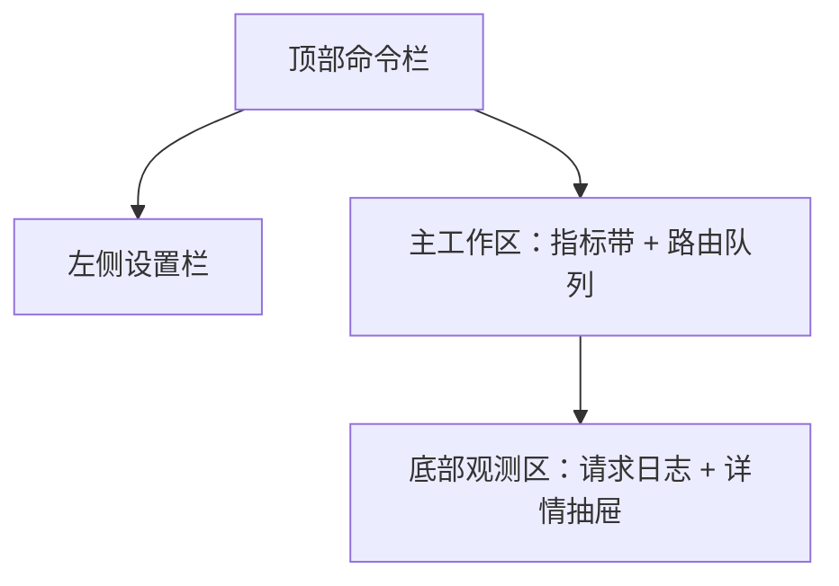

# RelayBench 透明代理 UI / 交互 / 动效施工文档

> 日期：2026-05-03  
> 依据：根目录 `DESIGN.md`、当前透明代理页、后台托盘和悬浮 Token 仪表需求  
> 定位：本文件重写并替代原透明代理施工文档中的 UI、交互、动画部分；协议转换、路由策略、熔断和数据库实现继续参考 `2026-05-03-transparent-proxy-gateway-optimization.md`。

## 1. 设计目标

透明代理页要从“功能堆叠页面”重做成“本地入口调度器控制台”。它应该像一个桌面运维仪表，而不是网页卡片合集。

目标体验：

- 一眼知道代理是否运行、入口地址是什么、当前请求是否正常。
- 路由、日志、健康、协议能力全部能扫描，不需要读大段说明。
- 配置编辑不依赖原始文本框，常用操作都有明确入口。
- 主窗口可关闭到托盘，代理继续后台运行。
- 悬浮 Token 仪表精致、轻量、像系统状态组件，不像缩小版 UI。
- 动画只服务状态变化，不做装饰。

强制基准：

- 遵守项目根目录 `DESIGN.md`。
- 主要页面保持浅色、清爽、数据密集。
- 使用 IBM Carbon 风格的清晰边界、低装饰、强可读性。
- 不做营销英雄区、不做大面积渐变、不做嵌套卡片。
- 所有文字必须可读，中文不能乱码。

## 2. 当前 UI 问题

当前透明代理页的问题不是单个控件难看，而是信息结构失衡：

- 顶部命令区文案乱码，用户无法确认按钮意义。
- 三列布局过窄，左侧 330px 里塞端口、限速、缓存、路由大文本框，视觉拥挤。
- 原始路由文本框承担主编辑职责，出错率高，也不适合展示优先级、协议、健康和熔断。
- 中间 DataGrid 列多且挤，`Base URL`、模型、协议支持被截断。
- 日志使用卡片列表，密度低，占空间，空白区大。
- 指标卡使用长句，不利于扫描。
- 状态反馈不够清楚：启动中、运行中、异常、停止中没有完整状态链。
- 没有后台运行模型，关闭窗口会和退出进程混淆。
- 悬浮 Token 需求如果直接做成小窗口表单，会破坏项目质感。

## 3. 视觉规范

### 3.1 颜色

使用 `DESIGN.md` 的 RelayBench 色板：

| 用途 | 颜色 |
| --- | --- |
| 主背景 | `#FFFFFF` |
| 页面底色 | `#F6F8FA` |
| 面板 | `#FFFFFF` |
| 次级面板 | `#F4F4F4` |
| 描边 | `#E0E0E0` |
| 强描边 | `#C6C6C6` |
| 主文字 | `#161616` |
| 次级文字 | `#525252` |
| 主操作蓝 | `#0F62FE` |
| 运行/健康绿 | `#24A148` |
| 降级/警告黄 | `#F1C21B` |
| 错误红 | `#DA1E28` |
| Token 流动绿 | `#0E9F6E` |
| Token 空闲灰蓝 | `#64748B` |

规则：

- 只有状态和主操作可以用高饱和色。
- 表格、面板、筛选栏以白、浅灰、细描边为主。
- 不使用大面积暗色界面；暗色只给代码/日志井或悬浮 Token 仪表的深色模式。
- 不使用装饰性渐变、光斑、浮球。

### 3.2 字体和数字

字体：

- UI：`Segoe UI`, `Microsoft YaHei UI`, `IBM Plex Sans`, `Inter`, sans-serif。
- 数字/URL/模型名：`Cascadia Mono`, `Consolas`, `JetBrains Mono`, monospace。

字号：

| 元素 | 字号 | 字重 |
| --- | --- | --- |
| 页面标题 | 18-20 | 600 |
| 区块标题 | 14-16 | 600 |
| 正文 | 12.5-13.5 | 400 |
| 表格正文 | 12-13 | 400 |
| 表头 | 11.5-12.5 | 600 |
| 状态徽标 | 10.5-11.5 | 600 |
| 指标数字 | 20-28 | 600 |
| 悬浮窗主数字 | 22-30 | 600 |

规则：

- 字距保持 0。
- 不用视口宽度动态缩放字体。
- 长 URL、模型名、请求 ID 必须省略并带 Tooltip。
- 数字使用等宽或 tabular 样式，避免跳动。

### 3.3 圆角、描边、阴影

- 主面板圆角 8px。
- 输入框、按钮、徽标 6-8px。
- 悬浮 Token 仪表 8px。
- 描边 1px，默认 `#E0E0E0`。
- 阴影只用于弹窗、抽屉、悬浮窗和托盘气泡，不用于普通页面面板。

禁止：

- 卡片套卡片。
- 每个区域都加重阴影。
- 大圆角胶囊堆满页面。

## 4. 页面结构

### 4.1 总体布局

透明代理页采用四层结构：



WPF 布局建议：

- 根：`Grid` 两行，命令栏 `Auto`，主体 `*`。
- 主体：`Grid` 两列，左侧设置栏 `Width=380 MinWidth=360 MaxWidth=420`，右侧 `*`。
- 右侧：三行，指标带 `Auto`，路由表 `2*`，日志区 `1*`。
- 1366px 下主体仍必须可用；宽度不足时表格横向滚动，不压扁核心列。

### 4.2 顶部命令栏

命令栏是页面的驾驶舱，不放长说明。

左侧：

- 标题：`透明代理`
- 副标题：`本地入口调度器`
- 运行态徽标：`已停止`、`启动中`、`运行中`、`停止中`、`异常`

中间：

- 本地入口：`http://127.0.0.1:17880/v1`
- 入口使用 monospace，过长省略。
- 单击复制，复制后 1.5 秒显示 `已复制`。

右侧：

- 启动/停止主按钮。
- 复制入口、探测协议、刷新路由、导入路由、清空日志为图标按钮。
- 图标按钮固定 36x36 或 40x40，必须有 Tooltip。

状态色：

| 状态 | 颜色 |
| --- | --- |
| 已停止 | 灰 |
| 启动中 | 蓝 |
| 运行中 | 绿 |
| 停止中 | 黄 |
| 异常 | 红 |

验收：

- 1366px 宽度下主按钮不能被挤出。
- 入口地址不能挤压按钮。
- 状态变化时按钮禁用态正确。
- 所有按钮文案和 Tooltip 无乱码。

### 4.3 左侧设置栏

左侧只放低频配置和策略，不放路由大文本框。

分组：

1. `监听`
   - 地址：默认 `127.0.0.1`
   - 端口：运行中只读
   - 健康端点：只读，可复制

2. `保护`
   - 每分钟请求上限
   - 并发上限
   - 上游超时
   - 流式首包超时
   - 流式空闲超时

3. `路由策略`
   - 优先级
   - 轮询
   - 最低延迟
   - 会话粘滞

4. `缓存与日志`
   - 短缓存开关
   - TTL
   - 日志脱敏状态
   - 响应摘要记录开关

交互：

- 每组标题可折叠，但默认展开 `监听` 和 `保护`。
- 运行中锁定监听地址和端口，显示锁图标和 Tooltip。
- 原始路由文本仅放在 `高级` 折叠区，用于导入/导出，不用于日常编辑。

验收：

- 左侧最小宽 360px 时标签和输入框不重叠。
- 输入错误显示字段级错误，不弹一堆 MessageBox。
- Toggle、输入框、下拉框高度稳定。

### 4.4 指标带

指标带放在主工作区顶部，用小型指标块，不用大卡片。

指标：

- 总请求
- 成功率
- 当前活跃
- Fallback
- 缓存命中
- P95 延迟

视觉：

- 每个指标宽度 120-160，高度 56-68。
- 数字使用 20-24px。
- 标签用 11-12px。
- 状态色只点亮当前有意义的指标，例如 Fallback > 0 才用警告色。

交互：

- 悬停显示口径 Tooltip。
- 单击指标可过滤下方日志，例如点击 Fallback 只看 fallback 请求。

### 4.5 路由队列

路由队列是页面核心，使用 DataGrid，不用卡片列表。

列：

| 列 | 宽度 | 内容 | 规则 |
| --- | --- | --- | --- |
| 优先级 | 56 | P1/P2 | 固定，圆形小标 |
| 启用 | 60 | Toggle | 固定 |
| 名称 | 160 min | 路由名 | 省略 + Tooltip |
| Base URL | 240 min | 脱敏 URL | 省略 + Tooltip |
| 模型 | 170 min | 模型/别名 | 省略 + Tooltip |
| 协议 | 180 min | `Responses`、`Anthropic`、`Chat` | Badge，不用 `R:Y` |
| 健康 | 110 | Healthy/Degraded/Down/Probing | Badge |
| 熔断 | 110 | Closed/Open/Half-open | Badge |
| 延迟 | 90 | P50/P95 | 右对齐 |
| 成功率 | 90 | 百分比 | 右对齐 |
| 操作 | 120 | 编辑、探测、更多 | 图标按钮 |

表格规则：

- 行高 38-40。
- 表头高 34-36。
- 启用行虚拟化和列虚拟化。
- 行 hover 只改变浅色背景，不改变高度。
- 选中行用 `primary-soft`，左侧可加 2px 蓝色条。
- 健康/熔断变化只更新对应 Badge，不导致整行重排。

空状态：

- 标题：`还没有上游路由`
- 动作：`从当前接口生成`、`批量导入`
- 不显示大插画。

### 4.6 日志和详情抽屉

日志区放在底部，使用紧凑 DataGrid。

列：

- 时间
- 状态
- 方法
- 路径
- 路由
- 协议
- 模型
- 耗时
- 结果
- 消息

筛选栏：

- 等级
- 路由
- 状态码
- 协议
- Fallback
- 关键字

详情抽屉：

- 从右侧滑入，不覆盖整页。
- 宽度 420-520。
- 展示请求 ID、路由尝试链、协议尝试顺序、fallback 原因、脱敏错误摘要。
- 关闭按钮固定右上角，Esc 可关闭。

安全：

- 不显示完整 API Key、Authorization、Cookie。
- URL query 中 token/key/password 必须脱敏。
- 错误摘要最多 300 字。

### 4.7 路由编辑弹窗

新增/编辑路由必须用弹窗。

布局：

- 宽 720，高 560 左右。
- 两列：左侧基础字段，右侧模型/协议/高级。
- 底部固定操作：取消、保存、保存并探测。

字段：

- 名称
- Base URL
- API Key
- 默认模型
- 优先级
- 启用状态
- 协议能力
- 模型别名
- 排除模型
- 自定义 Headers

交互：

- API Key 默认隐藏，只显示预览。
- 协议能力可自动探测，用户可手动覆盖。
- 保存前字段级校验。
- 保存成功后弹窗关闭并在路由表高亮该行 1 秒。

## 5. 后台和托盘交互

### 5.1 关闭行为

代理运行、后台驻留开启、悬浮窗开启时，点击关闭按钮不能退出软件。

行为：

| 用户动作 | 结果 |
| --- | --- |
| 点击关闭 | 主窗口隐藏到托盘 |
| Alt+F4 | 主窗口隐藏到托盘 |
| 双击托盘 | 恢复主窗口 |
| 托盘右键退出 | 真正退出 |

首次隐藏到托盘时提示：

```text
RelayBench 正在后台运行。右键托盘图标可退出。
```

只提示一次，避免打扰。

### 5.2 托盘菜单

菜单项：

- 打开 RelayBench
- 启动透明代理 / 停止透明代理
- 显示 Token 悬浮窗 / 隐藏 Token 悬浮窗
- 后台运行：开 / 关
- 退出 RelayBench

交互规则：

- 菜单文本必须反映当前状态。
- 退出前停止代理、关闭悬浮窗、释放托盘图标。
- 退出失败时显示一次托盘气泡。

视觉：

- 托盘图标使用项目品牌图标。
- 托盘菜单保持系统原生风格，不自绘复杂菜单。

## 6. 悬浮 Token 仪表

### 6.1 视觉定位

悬浮窗是“桌面仪表”，不是“迷你后台页面”。

默认规格：

- 尺寸：220 x 58。
- 圆角：8px。
- 背景：半透明深色或浅色玻璃质感。
- 描边：1px。
- 阴影：轻阴影。
- 主数字：22-30px，等宽数字。
- 标签：11-12px。

禁止：

- 放表格。
- 放多个按钮。
- 放说明段落。
- 做大面积渐变。
- 像一个小表单。

### 6.2 显示状态

| 状态 | 主显示 | 副显示 |
| --- | --- | --- |
| 流式输出中 | `42.8 tok/s` | `本阶段 12.4k` |
| 非流式刚完成 | `+861 tokens` | `平均 18.2 tok/s` |
| 空闲 5 秒后 | `12.4k tokens` | `本阶段累计` |
| 代理停止 | `0 tokens` | `等待请求` |
| 只有估算值 | `估算中` 或估算数字 | `estimated` |

轮换：

- 有数据时优先显示 tok/s。
- 无数据 5 秒后显示累计。
- 空闲时每 4 秒轮换：累计、输入/输出比例、最近请求耗时。
- 鼠标悬停暂停轮换并显示完整数值。

### 6.3 悬浮窗交互

- 拖动移动。
- 松手后贴边吸附。
- 双击打开主窗口并定位到透明代理页。
- 单击切换当前指标。
- 右键菜单：打开主窗口、锁定位置、鼠标穿透、重置本阶段计数、隐藏悬浮窗。
- 锁定后不能拖动。
- 鼠标穿透后右键菜单需要通过托盘恢复。

验收：

- 100%、125%、150% DPI 下清晰。
- 多显示器下不跑出屏幕。
- 数字变化不闪烁。
- 深浅桌面背景都可读。
- 不抢焦点。

## 7. 动效规范

### 7.1 动画原则

动画只做三件事：

- 告诉用户状态变了。
- 帮用户理解元素从哪里来、到哪里去。
- 让实时数据变化更平滑。

不要用动画装饰页面。

### 7.2 动画参数

| 场景 | 动画 | 时长 |
| --- | --- | --- |
| 按钮 hover | 背景/描边过渡 | 100-140ms |
| 按钮按下 | 轻微压低或色值变化 | 80-100ms |
| 状态徽标变化 | 颜色 + 文本淡入 | 150-200ms |
| 启动/停止状态 | Pill 淡入淡出 | 160-200ms |
| 运行中区域展开 | 高度 + 透明度 | 200-240ms |
| 折叠设置组 | 高度 + 透明度 | 180-220ms |
| 表格行 hover | 背景过渡 | 120-150ms |
| 新日志行 | 透明度 0 -> 1 | 120ms |
| 详情抽屉进入 | X 位移 12px + opacity | 160-200ms |
| 弹窗打开 | translateY 6px + opacity | 160ms |
| Toast/托盘提示 | opacity | 160ms |
| 悬浮窗数字变化 | 轻微淡入或数字滚动 | 180-240ms |
| 贴边吸附 | 位置缓动 | 180-220ms |

缓动：

- 默认 `CubicEase Out`。
- 关闭/收起可用 `CubicEase In`。
- 实时数字不要用夸张弹性曲线。

### 7.3 Reduced Motion

如果用户关闭动效：

- 保留状态颜色变化。
- 禁用位移和高度动画。
- 数字直接切换，不滚动。
- 弹窗直接淡入或直接出现。

## 8. 状态设计

所有区域必须有空、加载、错误、禁用状态。

### 8.1 页面级

| 状态 | UI |
| --- | --- |
| 首次进入 | 显示空路由状态和“从当前接口生成” |
| 启动中 | 主按钮禁用，状态 Pill 蓝色，显示小进度 |
| 运行中 | 启动按钮变停止，监听配置只读 |
| 停止中 | 停止按钮禁用，状态 Pill 黄色 |
| 异常 | 状态 Pill 红色，命令栏显示安全错误摘要 |

### 8.2 路由级

| 状态 | UI |
| --- | --- |
| 未探测 | 灰色 `Unknown` |
| 探测中 | 蓝色 `Probing` |
| 健康 | 绿色 `Healthy` |
| 降级 | 黄色 `Degraded` |
| 不可用 | 红色 `Down` |
| 熔断打开 | 红色 `Open` |
| 半开探测 | 蓝色 `Half-open` |

### 8.3 日志级

| 状态 | UI |
| --- | --- |
| INFO | 绿色或默认 |
| WARN | 黄色 |
| ERROR | 红色 |
| CACHE | 蓝色 |
| FALLBACK | 黄色 badge |

## 9. 可访问性和键盘

键盘：

- `Ctrl+C`：在选中入口或表格单元格时复制。
- `Esc`：关闭弹窗、抽屉、菜单。
- `Enter`：弹窗保存。
- `Ctrl+F`：聚焦日志搜索。
- `F5`：刷新路由/日志视图。

可访问性：

- 图标按钮必须有 Tooltip。
- 状态不能只靠颜色，必须有文字。
- 焦点框清晰可见。
- 点击区域最小 32px。
- 表格支持键盘选择。

## 10. WPF 施工清单

### 10.1 样式资源

优先新增/调整：

- `RelayBench.App/Resources/WorkbenchTheme.xaml`
- `RelayBench.App/Resources/Motion.xaml`
- `RelayBench.App/Infrastructure/MotionAssist.cs`

建议新增样式：

- `GatewayCommandBarStyle`
- `GatewayMetricStripStyle`
- `GatewayStatusBadgeStyle`
- `GatewayDataGridStyle`
- `GatewayFilterBarStyle`
- `GatewayDetailDrawerStyle`
- `FloatingTokenMeterWindowStyle`

### 10.2 页面文件

阶段 A 改：

- `RelayBench.App/Views/Pages/TransparentProxyPage.xaml`
- `RelayBench.App/ViewModels/MainWindowViewModel.TransparentProxy.cs`
- `RelayBench.App/ViewModels/TransparentProxyRouteViewModel.cs`
- `RelayBench.App/ViewModels/TransparentProxyLogEntryViewModel.cs`

阶段 B 改：

- `RelayBench.App/Views/FloatingTokenMeterWindow.xaml`
- `RelayBench.App/ViewModels/FloatingTokenMeterViewModel.cs`
- `RelayBench.App/Services/TrayLifecycleService.cs`

### 10.3 XAML 必做规则

- DataGrid 开启虚拟化。
- 核心列设置 `MinWidth`。
- 长文本设置 `TextTrimming=CharacterEllipsis`。
- ToolTip 绑定完整值。
- 按钮、徽标、输入框高度固定。
- 运行中/停止中/异常状态不能导致布局跳动。

## 11. UI 验收矩阵

尺寸：

- 1366x768
- 1600x900
- 1920x1080
- 125% DPI
- 150% DPI

数据：

- 0 条路由
- 1 条路由
- 12 条路由
- 50 条路由
- 0 条日志
- 20 条日志
- 2000 条日志
- 超长 Base URL
- 超长模型名
- 超长错误消息

状态：

- 已停止
- 启动中
- 运行中
- 停止中
- 异常
- 路由健康
- 路由降级
- 路由熔断
- 后台驻留
- 悬浮窗流动中
- 悬浮窗空闲

禁止通过：

- 任意中文乱码。
- 任意核心按钮被挤出。
- 表格文字重叠。
- 长 URL 撑破布局。
- 点击关闭直接退出后台代理。
- 悬浮 Token 仪表像小表单。
- 日志或 Tooltip 出现完整密钥。
- 动画导致列宽、行高、按钮尺寸跳动。

## 12. 施工阶段

### 阶段 1：UI 急救

- 修乱码。
- 重排命令栏。
- 去掉主界面的路由大文本框。
- 左侧设置栏按分组重做。
- 路由表和日志表改成 DataGrid。
- 指标带改为短指标。

验收：页面在 1366x768 可读可用。

### 阶段 2：交互补齐

- 路由编辑弹窗。
- 日志筛选栏。
- 详情抽屉。
- 复制入口反馈。
- 启停状态链。
- 字段级校验。

验收：用户不需要编辑原始文本也能完成常用路由管理。

### 阶段 3：动效统一

- 抽出页面动效资源。
- 给状态 Pill、折叠组、详情抽屉、弹窗、日志新行加轻量动效。
- 支持 reduced motion。

验收：动效不造成布局跳动。

### 阶段 4：后台托盘

- 关闭隐藏到托盘。
- 托盘菜单。
- 真正退出路径。
- 首次隐藏提示。

验收：代理运行时关闭窗口不退出进程，托盘退出释放端口。

### 阶段 5：悬浮 Token 仪表

- 悬浮窗视觉。
- tok/s 和累计 token 轮换。
- 拖动、吸附、锁定、鼠标穿透。
- 多 DPI 和多显示器修正。

验收：悬浮窗精致、轻量、稳定，不抢焦点。

## 13. 构建和发布

每个代码阶段完成后执行：

```powershell
dotnet build .\RelayBenchSuite.slnx -c Debug -v minimal /p:UseSharedCompilation=false
dotnet test .\RelayBench.Core.Tests\RelayBench.Core.Tests.csproj -c Debug -v minimal /p:UseSharedCompilation=false
dotnet publish .\RelayBench.App\RelayBench.App.csproj -c Release -r win-x64 --self-contained false -o H:\relaybench-v0.1.4-win-x64-framework-dependent /p:UseSharedCompilation=false
```

发布后启动并保持打开：

```powershell
Start-Process -FilePath "H:\relaybench-v0.1.4-win-x64-framework-dependent\RelayBench.App.exe" -WorkingDirectory "H:\relaybench-v0.1.4-win-x64-framework-dependent" -WindowStyle Normal
```

## 14. 最终判断

这轮 UI 重写的核心不是“把界面做炫”，而是把 RelayBench 做成一个稳定、精致、耐用的桌面仪表。透明代理页要让用户放心把它长期开在后台；悬浮窗要像一个安静的小仪器；托盘交互要符合 Windows 用户直觉；所有动画都应该轻、准、短。
